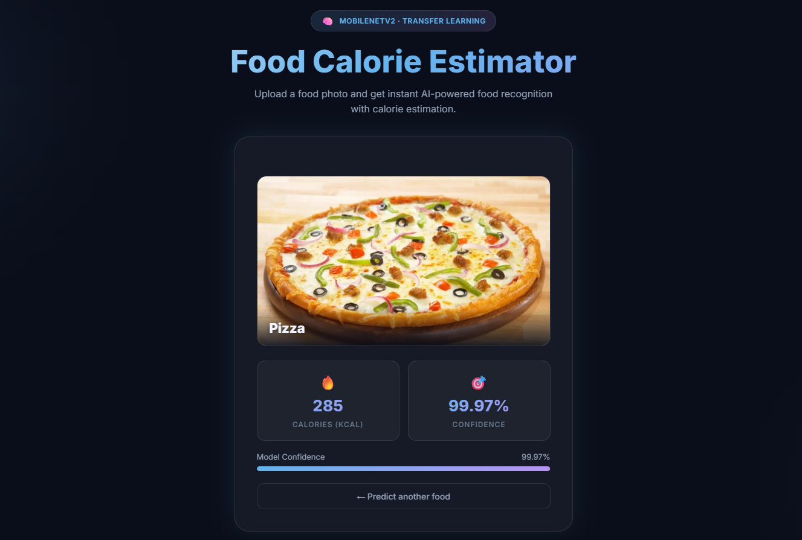
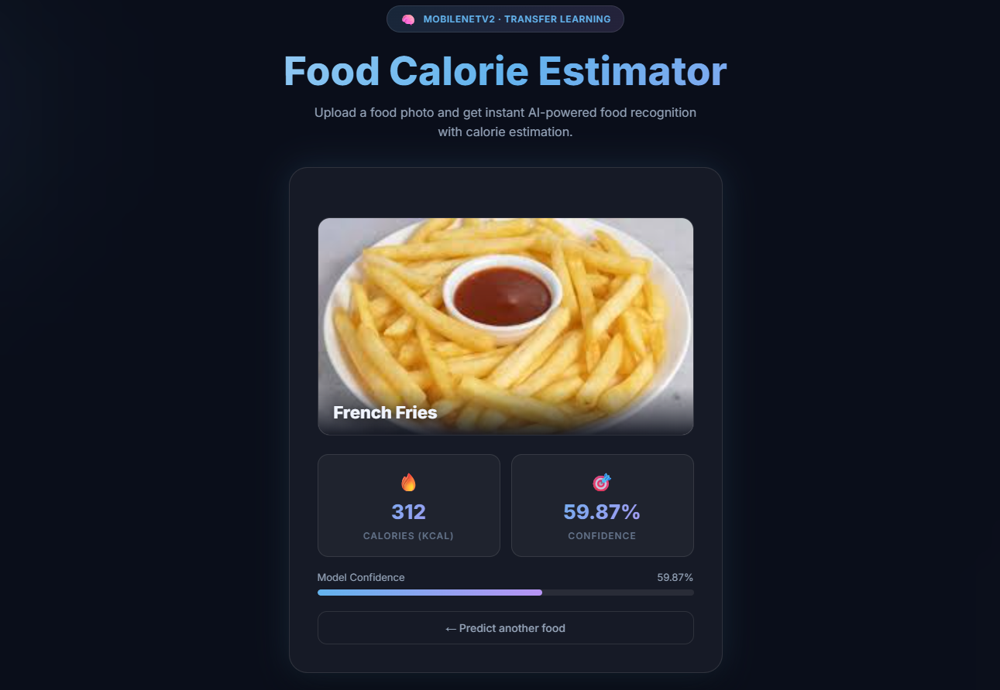
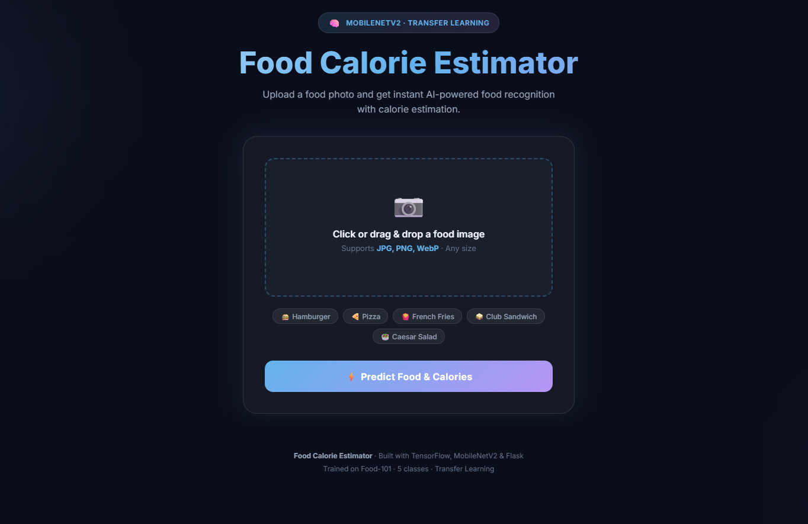

# 🍔 Food Calorie Estimator

<p align="center">
  
  
  
  
  
</p>

<p align="center">
  An AI-powered web application that identifies food from a photo and estimates its calorie content — built with Deep Learning, Flask, and Docker.
</p>

---

## 📸 Screenshots

### Home Page


### Pizza Prediction — 285 kcal | 99.97% Confidence


### French Fries Prediction — 312 kcal | 59.87% Confidence


---

## ✨ Features

- 📷 **Drag & Drop image upload** — JPG, PNG, WebP supported
- 🧠 **AI-powered food recognition** using MobileNetV2 (Transfer Learning)
- 🔥 **Calorie estimation** per serving from a JSON database
- 📊 **Confidence score** with visual progress bar
- 🐳 **Docker-ready** — run anywhere with a single command
- 🌐 **Flask web backend** with Jinja2 templating
- 🎨 **Dark-themed responsive UI** with smooth animations

---

## 🍽️ Supported Food Classes

| Food | Calories (per serving) |
|------|----------------------|
| 🍔 Hamburger | 295 kcal |
| 🍕 Pizza | 285 kcal |
| 🍟 French Fries | 312 kcal |
| 🥪 Club Sandwich | 250 kcal |
| 🥗 Caesar Salad | 150 kcal |

---

## 🧠 Machine Learning Details

| Aspect | Detail |
|--------|--------|
| **Technique** | Transfer Learning (Feature Extraction) |
| **Base Model** | MobileNetV2 (pretrained on ImageNet, frozen) |
| **Dataset** | Food-101 (5 selected classes, 200 images each) |
| **Input Size** | 224 × 224 × 3 (RGB) |
| **Classification Head** | GlobalAveragePooling2D → Dense(128, ReLU) → Dense(5, Softmax) |
| **Loss Function** | Categorical Crossentropy |
| **Optimizer** | Adam (lr=0.001) |
| **Epochs** | 5 |
| **Train/Val Split** | 80% / 20% |
| **Trainable Params** | ~164,613 (head only, base frozen) |

---

## 🗂️ Project Structure

```
ml project/
├── app.py               # Flask web application & inference logic
├── train_model.py       # Model training script (MobileNetV2 transfer learning)
├── calories.json        # Calorie database (food → kcal mapping)
├── requirements.txt     # Python dependencies
├── Dockerfile           # Docker build instructions
├── .dockerignore        # Excludes dataset & cache from Docker image
├── .gitignore           # Excludes dataset & cache from GitHub
├── model/
│   └── food_model.h5    # Trained Keras model (generated by train_model.py)
├── templates/
│   └── index.html       # Frontend UI (Jinja2 template)
├── static/
│   └── uploads/         # Temporary uploaded image storage
└── dataset/             # Food-101 training images (not in repo — too large)
```

---

## 🚀 How to Run

### Option A — Run Locally (Python)

```bash
# 1. Install dependencies
pip install -r requirements.txt

# 2. Train the model (first time only — takes 10–30 min)
python train_model.py

# 3. Start the server
python app.py

# 4. Open in browser
http://127.0.0.1:5000
```

### Option B — Run with Docker 🐳 (Recommended)

> Make sure Docker Desktop is installed and running

```bash
# 1. Build the image (first time only — takes 10–15 min)
docker build -t food-calorie-estimator .

# 2. Run the container
docker run -p 5000:5000 food-calorie-estimator

# 3. Open in browser
http://localhost:5000
```

### Transfer to Another PC (No reinstall needed!)

```bash
# Save image to file
docker save -o food-calorie-estimator.tar food-calorie-estimator

# On new PC — load and run
docker load -i food-calorie-estimator.tar
docker run -p 5000:5000 food-calorie-estimator
```

---

## ⚙️ Tech Stack

| Layer | Technology |
|-------|-----------|
| ML Framework | TensorFlow / Keras 2.21.0 |
| CNN Architecture | MobileNetV2 (ImageNet pretrained) |
| Image Processing | Pillow (PIL) |
| Web Framework | Flask 2.3.3 |
| Production Server | Gunicorn |
| Frontend | HTML5 + CSS3 + JavaScript |
| Containerization | Docker |
| Language | Python 3.10 |

---

## 🔄 How It Works (Inference Pipeline)

```
User uploads image
       ↓
Flask receives file → saves to static/uploads/
       ↓
Pillow: resize to 224×224, convert to RGB
       ↓
NumPy: normalize pixels [0, 255] → [0.0, 1.0]
       ↓
MobileNetV2: extract deep features
       ↓
Dense head: Softmax → probability for each of 5 classes
       ↓
np.argmax() → food class name
       ↓
calories.json lookup → calorie value
       ↓
Result shown: food name + calories + confidence %
```

---

## 📦 Requirements

```
tensorflow==2.21.0
flask==2.3.3
Pillow==10.0.0
numpy>=1.26.0
werkzeug==2.3.7
gunicorn==21.2.0
```

---

## 📌 Notes

- The `dataset/` folder is **not included** in this repo (too large — several GB). Download Food-101 from [Kaggle](https://www.kaggle.com/dansbecker/food-101) and place under `dataset/images/`.
- The trained model `model/food_model.h5` is included so you can run the app directly without retraining.
- Docker image runs on **CPU only** (no GPU required).

---

<p align="center">Made with ❤️ using TensorFlow, Flask & Docker</p>
